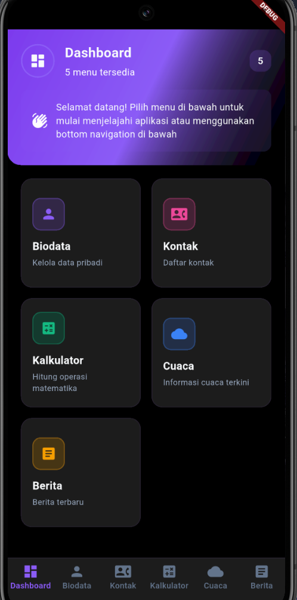
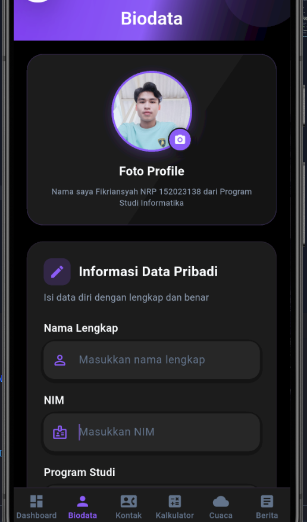
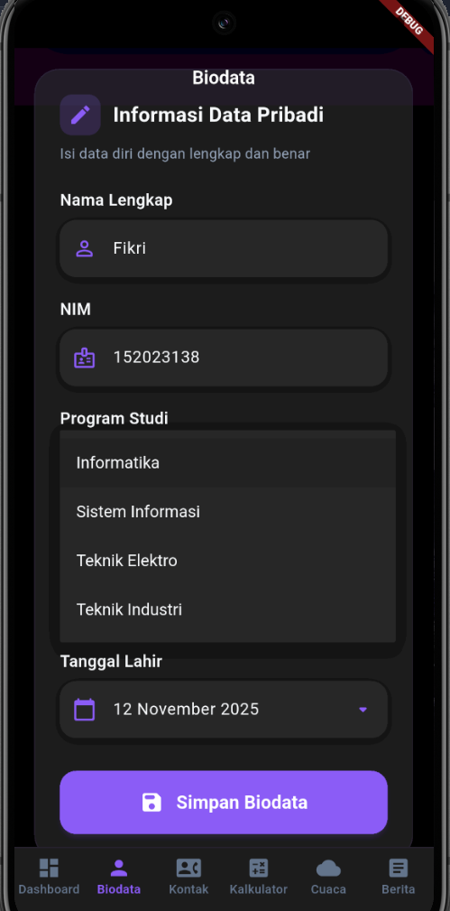
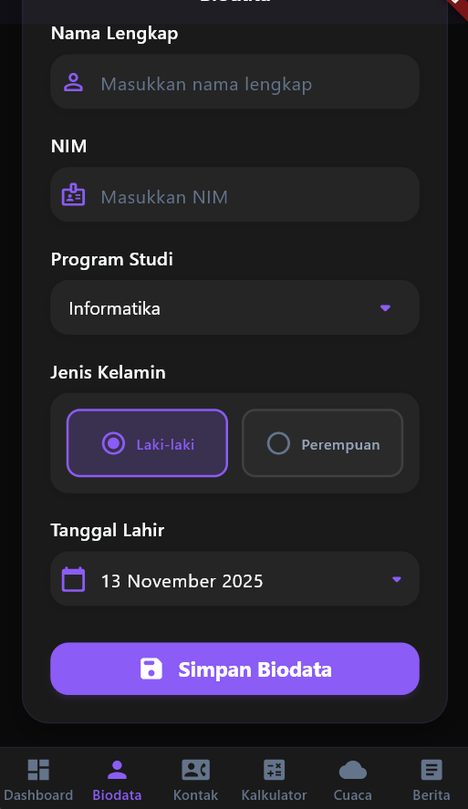
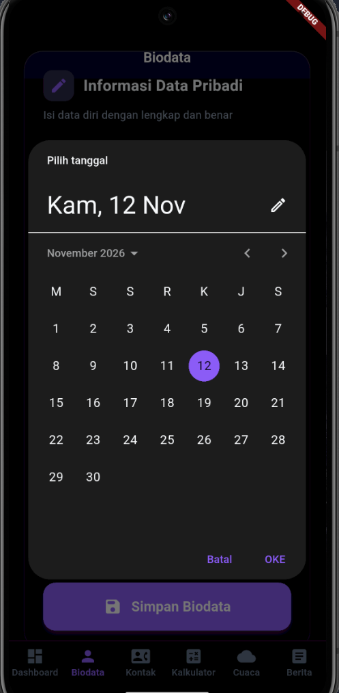
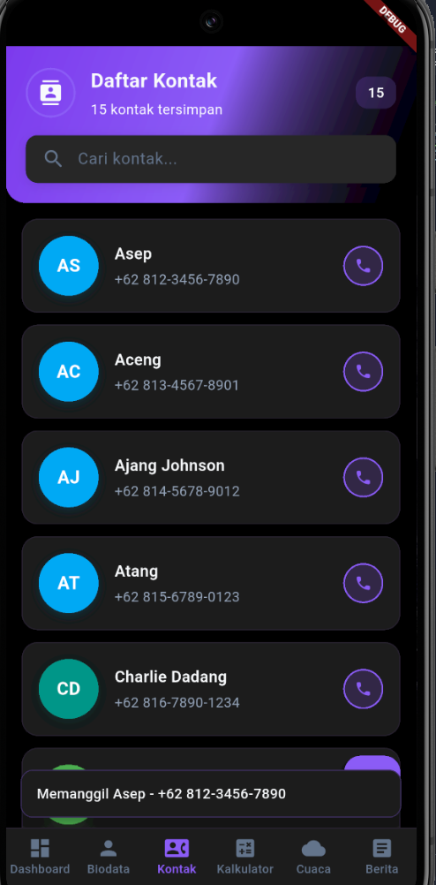
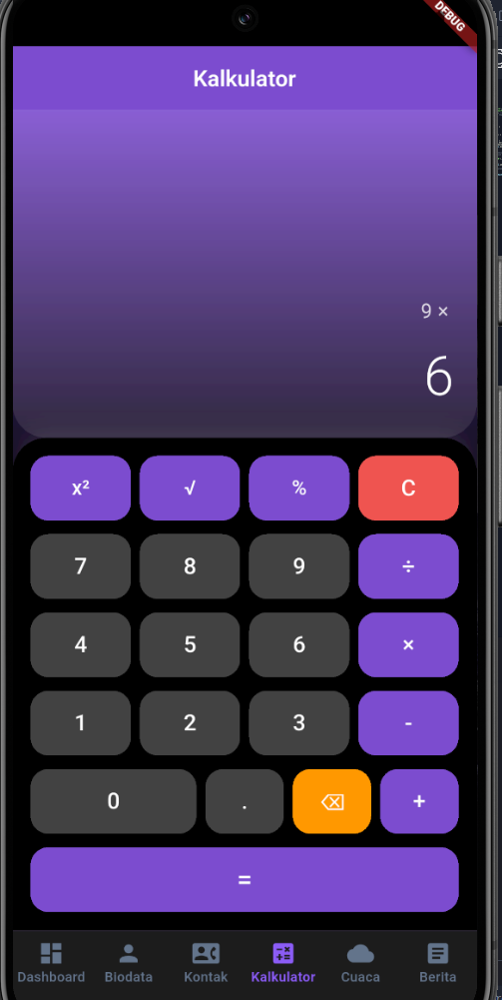
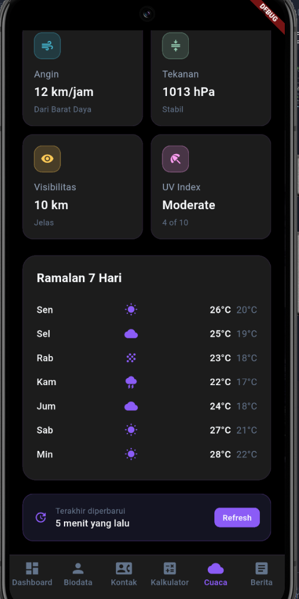
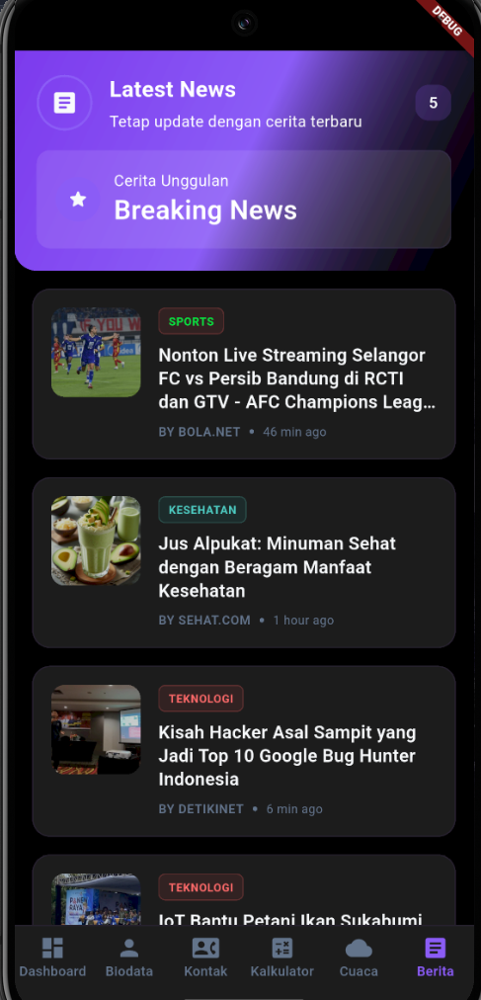
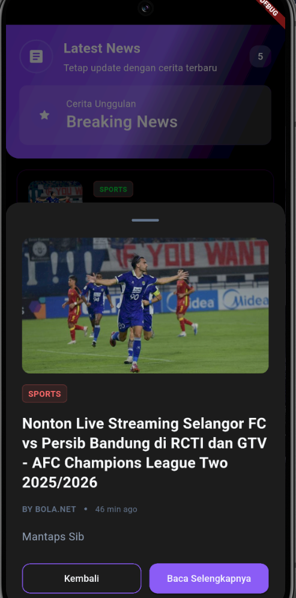

# 📱 App Mobile

## 📖 Tentang Aplikasi

Aplikasi mobile Flutter yang menyediakan 6 fitur utama: Biodata, Kontak, Kalkulator, Cuaca, Berita, dan Dashboard sebagai navigasi utama.

## 👥 Developer

- Fikriansyah - 15202318

---

## ❓ JAWABAN SOAL NOMOR 1

### Implementasi Splash Screen

###

---

**Deskripsi:**
Splash screen diimplementasikan dengan durasi 5 detik menampilkan:

- Judul aplikasi
- Foto developer
- NIM dan nama lengkap
- Animasi loading

**Requirement:**

- ✅ Durasi 5 detik
- ✅ Judul aplikasi
- ✅ Foto developer
- ✅ NIM dan nama
- ✅ Auto pindah ke Dashboard

## 📸 Halaman-Halaman Aplikasi

### 🏠 Halaman Dashboard

###

---

**Deskripsi:**
Halaman utama dengan navigasi ke 5 fitur menggunakan **Bottom Navigation Bar**

**Menu:**

- 📝 Biodata
- 📞 Kontak
- 🧮 Kalkulator
- 🌤️ Cuaca
- 📰 Berita

**Navigasi:**

- ✅ Bottom Navigation Bar
- ✅ Konsep Fragment untuk setiap menu
- ✅ Semua menu dapat diklik di dashboardnya atau di bagian buttom navigasi

---

### 👤 Halaman Biodata

###

---

###

---

###

---

###

---

**Deskripsi:**
Form biodata dengan berbagai input field dan foto profile.

**Form Elements:**

- 📷 Foto profile
- 📝 Text field
- 🔽 Dropdown
- 🔘 Radio button
- 📅 Calendar
- 💾 Tombol simpan

---

### 📞 Halaman Kontak

###

---

**Deskripsi:**
Daftar 15 kontak telepon statis dengan layout teks dan circle image.

**Features:**

- ✅ 15 kontak telepon statis
- 👤 Circle image untuk setiap kontak
- 📱 Layout list
- 🔍 Design modern dan user-friendly

---

### 🧮 Halaman Kalkulator

###

---

**Deskripsi:**
Kalkulator sederhana dengan operasi matematika lengkap.

**Operasi:**

- ➕ Tambah
- ➖ Kurang
- ✖️ Kali
- ➗ Bagi
- ² Kuadrat
- √ Akar kuadrat
- 🗑️ Tombol hapus/clear

---

### 🌤️ Halaman Cuaca

###

---

###

---

**Deskripsi:**
Display informasi cuaca statis dengan animasi visual yang menarik.

**Informasi:**

- 🌡️ Suhu temperatur
- 💧 Kelembapan
- 🌬️ Kecepatan angin
- ☁️ Kondisi cuaca
- 🎨 Animasi kondisi cuaca
- 🖼️ Gambar ilustrasi cuaca yang menarik

---

### 📰 Halaman Berita

###

---

###

---

**Deskripsi:**
List berita statis dengan layout card yang berulang (recycler view).

**Layout:**

- 📋 List/Card layout berulang
- 🖼️ Thumbnail berita
- 🖼️ Berita ketika di klik akan menampilkan detail nya
- 📖 Judul dan deskripsi singkat
- 🕐 Tanggal publish
- ♻️ Konsep recycler view

---

## 🛠️ Teknologi yang Digunakan

- **Framework:** Flutter 3.0+
- **Language:** Dart
- **State Management:** Provider
- **Navigation:** Bottom Navigation Bar
- **UI Components:** Material Design
- **Animation:** Flutter Animations
